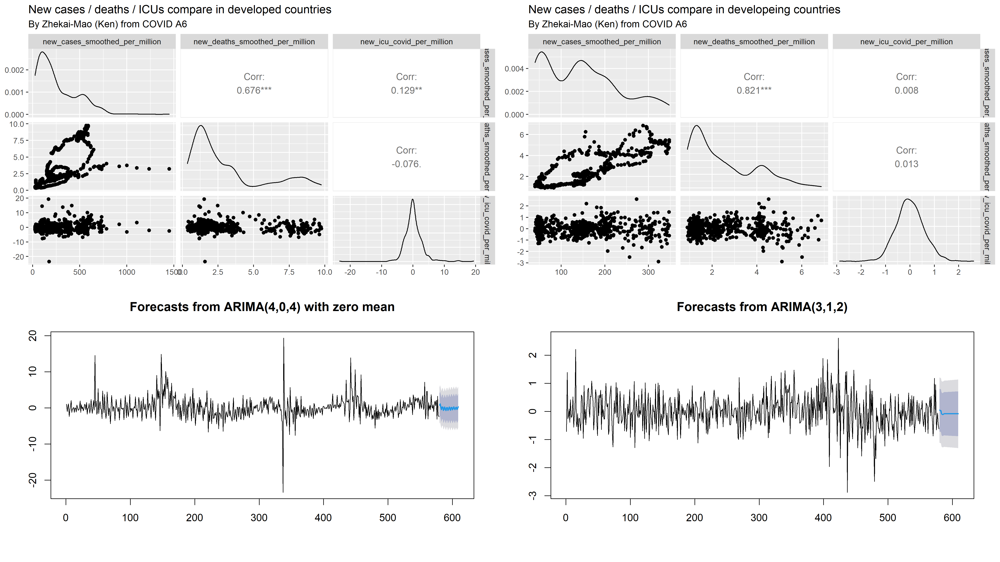

```{r setup, include=FALSE}
knitr::opts_chunk$set(echo = TRUE, warning=FALSE, message=FALSE, error=FALSE)
```

```{r library, cache=FALSE, message=FALSE}

# General
library(tidyverse)
library(readxl)
library(ggplot2)
library(ggthemes)
library(plotly)
library(dplyr)
library(lubridate)
library(GGally)
# library(randomcoloR)
library(forecast)
library(viridis)
library(dplyr)
library(skimr)
library(gridExtra)

# For url
library(XML)
library(RCurl)
library(rlist)

# For map
library(sf)
library(rnaturalearth)
library(rnaturalearthdata)

```

# Executive Summary

```{r old import, include=FALSE}
# ## Q1 Ken Part ----
# 
# covid_used_ken <- covid[c("location",
#                           "date",
#                           "new_cases_smoothed",
#                           "new_cases_smoothed_per_million",
#                           "new_deaths_smoothed",
#                           "new_deaths_smoothed_per_million",
#                           "population",
#                           "population_density")]
# 
# 
# covid_A6_ken <- read.csv(
#   "data/processed/covid_A6_ken.csv"
# )
# covid_A6_ken_develop <- read.csv(
#   "data/processed/covid_A6_ken_develop.csv"
# )
# 
# 
# 
# ## Q2 Eva Part ----
# 
# covid_A6_eva <- read.csv(
#   "data/processed/covid_A6_eva.csv"
# )
# 
# covid_A6_eva_developed <- read.csv(
#   "data/processed/covid_A6_eva_developed.csv"
# )
# 
# covid_A6_eva_developing <- read.csv(
#   "data/processed/covid_A6_eva_developing.csv"
# )
# 
# 
# 
# ## Q3 Pat Part ----
# 
# covid_A6_pat_developed <- read.csv(
#   "data/processed/covid_A6_pat_developed.csv"
# )
# covid_A6_pat_developing <- read.csv(
#   "data/processed/covid_A6_pat_developing.csv"
# )
# 
# 
# 
# ## Q4 Gary Part ----
# 
# covid_A6_gary <- read.csv(
#   "data/processed/covid_A6_gary.csv"
# )
# 
# 
# 
# ## Q5 Amber Part ----
# 
# covid_A6_amber <- read.csv(
#   "data/processed/covid_A6_amber.csv"
# )
# 
# covid_A6_amber_developed <- read.csv(
#   "data/processed/covid_A6_amber_developed.csv"
# )
# 
# covid_A6_amber_developing <- read.csv(
#   "data/processed/covid_A6_amber_developing.csv"
# )
# 
# covid_aus_mal_amber <- rbind(
#   covid_A6_amber[covid_A6_amber$location == 'Australia', ],
#   covid_A6_amber[covid_A6_amber$location == 'Malaysia', ]
# )
# 
# Malaysia_amber <- covid_A6_amber[covid_A6_amber$location == 'Malaysia', ]
# Malaysia_amber$date <- as.Date(Malaysia_amber$date)
# 
# Australia_amber <- covid_A6_amber[covid_A6_amber$location == 'Australia', ]
# Australia_amber$date <- as.Date(Australia_amber$date)
```

```{r loading data}
# Loading data ----

# If you want to update the data, set it as TRUE. 
# Or read csv directly from the link of the data
update_data <- FALSE

if (!dir.exists("data")) {
  dir.create("data")
}

if (update_data | !file.exists("data/owid-covid-data.csv")) {
  download.file("https://covid.ourworldindata.org/data/owid-covid-data.csv",
                destfile = file.path(getwd(), "/data/owid-covid-data.csv"))

}

covid_data <- read.csv("data/owid-covid-data.csv",
                       stringsAsFactors = FALSE,
                       check.names =  FALSE)

covid_data$date <- as.Date(covid_data$date)
covid_data$new_cases[covid_data$new_cases < 0] <- 0
covid_data$new_cases_smoothed[covid_data$new_cases_smoothed < 0] <- 0

covid <- read.csv("data/owid-covid-data.csv")

```

Since the start of the pandemic, COVID-19 is responsible for the deaths of over six million people. Travel restrictions were put in place to inhibit the spread of the virus. With mass vaccination campaigns carried out across different countries, those travel restrictions are now being lifted continuously to allow for international travel again. 

Even so, travellers should still be wary of COVID-19 and its potential risks; different factors such as the traveller’s age, underlying diseases, vaccination status, the destination country’s population density, and ICU admission rates should all be considered. It was found that in terms of age, travellers aged 60 and over are most at risk of death from COVID-19. Further, underlying diseases such as Hepatitis, Measles, Pertussis, and Aids may increase an individual’s chances of dying from the virus.

Additional features such as the country’s population density and ICU admission rates were also used to determine the comparable risks between the developing and developed countries. As a result, the population density of a country is not a significant factor in determining a country’s Covid death rate, ICU admissions rates were also not a significant factor in determining such fact.

These findings will allow travellers who are looking to travel to know whether the destination they are travelling to will have risks for individuals like themselves in order for them to make more informed decisions and take better precautions now that restrictions are easing up.


# Background

The project's aim is to build an interactive app for people who are looking to travel during COVID and aim to give them a thorough analysis of the differences in risks between developed countries and developing countries and give them a better idea of the vulnerabilities they are exposed to if they chose certain countries.

The 5 different perspectives are ICU, Population Density, Diseases, Vaccination rate and Age. For the analysis of ICU, Disease and Age were imported as extra datasets to aid our analysis.


## Target audience

The target audience has changed throughout our analysis, the project settled on people who are looking to travel during COVID and aims to give them a thorough analysis of the differences in risks between developed countries and developing countries and give them a better idea of the vulnerabilities they are exposed to if they chose certain countries.


## Map

```{r map}
## MAPS ----

world <- ne_countries(scale = "medium", returnclass = "sf")

developed_countries_full <- filter(covid, human_development_index >= 0.854)
developed_countries_code <- unique(developed_countries_full$iso_code)

world$developed <- ifelse(
  world$iso_a3 %in% developed_countries_code,
  "Yes",
  "No")

plot_map_develop <- ggplot(data = world) +
  geom_sf(aes(fill = developed)) + 
  labs(title = "Map of developed and developing countries",
       subtitle = "From COVID A6",
       x = "Latitude",
       y = "Longitude",
       fill = "Developed Country / Region"
  )
    
ggplotly(plot_map_develop)
```
*Figure 1, Map of developed countries vs. developing countries by Human Development Index*


This is a map of countries which is divided by each country’s human development index with a benchmark of 0.84 where countries below this threshold are considered developing while countries above are considered to be developed. The project was interested in investigating the differences between developing and developed countries since a higher Human development index or HDI is found to be correlated with higher healthcare spending which should in turn result in lower total deaths between the start of the pandemic and the start of this year.


# Method


## ICU

### Cleaning

```{r ICU_Cleaning}
# New ICU cases
new_icu_covid_function <- function(location_icu_full) {
  new_icu_list <- c()
  is_first_time = TRUE
  for (i in 1:length(location_icu_full$icu_covid)) {
    if (is_first_time){
      new_icu = location_icu_full$icu_covid[i]
      is_first_time = FALSE
    }
    else {
      new_icu = location_icu_full$icu_covid[i] - location_icu_full$icu_covid[i-1]
    }
    new_icu_list <- append(new_icu_list, new_icu)
  }
  location_icu_full <- cbind(location_icu_full, new_icu_covid = new_icu_list)
  return(location_icu_full)
}


covid_used <- covid[c("location",
                      "date",
                      "new_cases_smoothed",
                      "new_cases_smoothed_per_million",
                      "new_deaths_smoothed",
                      "new_deaths_smoothed_per_million",
                      "population",
                      "population_density",
                      "human_development_index")]

# ---

# icu data - Chile
# chile_icu_patient <- read.csv("https://github.com/MinCiencia/Datos-COVID19/raw/master/output/producto8/UCI_T.csv")
chile_icu_full <- read.csv("https://github.com/MinCiencia/Datos-COVID19/raw/master/output/producto20/NumeroVentiladores_T.csv")

chile_icu_full <- rename(chile_icu_full, c(date = Ventiladores, beds_icu = total, icu_covid = disponibles, icu_free = ocupados))
chile_icu_full <- cbind(location = "Chile", chile_icu_full)
chile_icu_full <- rename(chile_icu_full, icu_total = beds_icu)
chile_icu_full <- cbind(chile_icu_full, icu_occupancy_rate = chile_icu_full$icu_covid / chile_icu_full$icu_total * 100)
chile_icu_full <- new_icu_covid_function(chile_icu_full)

# ---

# icu data - Malaysia
# malaysia_icu_full <- read.csv("data/icu.csv")
malaysia_icu_full <- read.csv("https://raw.githubusercontent.com/MoH-Malaysia/covid19-public/main/epidemic/icu.csv")

malaysia_icu_full <- malaysia_icu_full[, -2]
malaysia_icu_full <- aggregate(cbind(beds_icu_total, icu_covid) ~ date, data = malaysia_icu_full, sum)
malaysia_icu_full <- cbind(location = "Malaysia", malaysia_icu_full)
malaysia_icu_full <- rename(malaysia_icu_full, icu_total = beds_icu_total)
malaysia_icu_full <- cbind(malaysia_icu_full, icu_free = malaysia_icu_full$icu_total - malaysia_icu_full$icu_covid)
malaysia_icu_full <- cbind(malaysia_icu_full, icu_occupancy_rate = malaysia_icu_full$icu_covid / malaysia_icu_full$icu_total * 100)
malaysia_icu_full <- new_icu_covid_function(malaysia_icu_full)

# ---

# icu data - United_states
# united_states_icu_full <- read.csv("data/COVID-19_Reported_Patient_Impact_and_Hospital_Capacity_by_State_Timeseries.csv")
united_states_icu_full <- read.csv("https://healthdata.gov/api/views/g62h-syeh/rows.csv?accessType=DOWNLOAD")

united_states_icu_full <- united_states_icu_full[, -1]
united_states_icu_full <- aggregate(cbind(total_staffed_adult_icu_beds, staffed_icu_adult_patients_confirmed_covid) ~ date, data = united_states_icu_full, sum)
united_states_icu_full <- cbind(location = "United States", united_states_icu_full)
united_states_icu_full <- rename(united_states_icu_full, icu_total = total_staffed_adult_icu_beds)
united_states_icu_full <- rename(united_states_icu_full, icu_covid = staffed_icu_adult_patients_confirmed_covid)
united_states_icu_full <- cbind(united_states_icu_full, icu_free = united_states_icu_full$icu_total - united_states_icu_full$icu_covid)
united_states_icu_full <- cbind(united_states_icu_full, icu_occupancy_rate = united_states_icu_full$icu_covid / united_states_icu_full$icu_total * 100)
united_states_icu_full <- new_icu_covid_function(united_states_icu_full)

# ---

# icu data - Switzerland
switzerland_icu_full <- read.csv("data/bag_covid_19_data_csv_03_May_2022/COVID19HospCapacity_geoRegion.csv")

# temp <- tempfile()
# temp2 <- tempfile()
# # download.file("https://www.covid19.admin.ch/api/data/20220503-ls6se5v3/downloads/sources-csv.zip", temp)
# unzip(zipfile = temp, exdir = temp2)
# switzerland_icu_full <- read.csv(file.path(temp2, "./COVID19HospCapacity_geoRegion.csv"))
# rm("temp", "temp2")

switzerland_icu_full <- switzerland_icu_full[, -2]
switzerland_icu_full <- aggregate(cbind(ICU_Capacity, ICU_Covid19Patients, ICU_FreeCapacity) ~ date, data = switzerland_icu_full, sum)
switzerland_icu_full <- cbind(location = "Switzerland", switzerland_icu_full)
switzerland_icu_full <- rename(switzerland_icu_full, icu_total = ICU_Capacity)
switzerland_icu_full <- rename(switzerland_icu_full, icu_covid = ICU_Covid19Patients)
switzerland_icu_full <- rename(switzerland_icu_full, icu_free = ICU_FreeCapacity)
switzerland_icu_full <- cbind(switzerland_icu_full, icu_occupancy_rate = switzerland_icu_full$icu_covid / switzerland_icu_full$icu_total * 100)
switzerland_icu_full <- new_icu_covid_function(switzerland_icu_full)

# ---

# Developed country data

# WAY1
developed_countries_full <- filter(covid_used, human_development_index >= 0.854)
developed_countries <- unique(developed_countries_full$location)

covid_used$developed <- ifelse(
  covid_used$location %in% developed_countries,
  "Yes",
  "No")

# developing_countries <- test %>% #Filtering countries which are developing and already developed by their hdi(human development index)
#   filter(hdi < 0.854)
# developing_countries <- subset(developing_countries, location!="World")

# WAY2
# tables <- getURL("https://worldpopulationreview.com/country-rankings/developed-countries",.opts = list(ssl.verifypeer = FALSE)) %>% readHTMLTable()
# developed_countries_full <- tables[[1]]
# rm(tables)
# developed_countries_full <- read.csv("data/csvData.csv")

# ---

# Range of date
start_date <- "2020-06-01"
end_date <- "2021-12-31"

range_data <- function(data, start_date, end_date){
  data$date <- as.Date(data$date)
  data <- data[(data$date >= start_date & data$date <= end_date), ]
  return(data)
}

covid_used <- range_data(covid_used, start_date, end_date)
malaysia_icu_full <- range_data(malaysia_icu_full, start_date, end_date)
chile_icu_full <- range_data(chile_icu_full, start_date, end_date)
united_states_icu_full <- range_data(united_states_icu_full, start_date, end_date)
switzerland_icu_full <- range_data(switzerland_icu_full, start_date, end_date)

# ---

# Countries chose in Q1
countries <- c("Chile",
              "Malaysia",
              "Switzerland",
              "United States")

countries <- sort(countries)

## selecting countries and required time period.
covid_used_selected <- covid_used[covid_used$location %in% countries, ]

## covid <- covid_full %>% filter(covid_full$location %in% countries) ## Alternative

covid_A6_k <- rbind(chile_icu_full, malaysia_icu_full, switzerland_icu_full, united_states_icu_full)

covid_A6_k <- merge(covid_used_selected, covid_A6_k, by = c("location", "date"))

covid_A6_k <- cbind(covid_A6_k, icu_total_per_million = covid_A6_k$icu_total / covid_A6_k$population * 1000000)
covid_A6_k <- cbind(covid_A6_k, icu_covid_per_million = covid_A6_k$icu_covid / covid_A6_k$population * 1000000)
covid_A6_k <- cbind(covid_A6_k, icu_free_per_million = covid_A6_k$icu_free / covid_A6_k$population * 1000000)
covid_A6_k <- cbind(covid_A6_k, new_icu_covid_per_million = covid_A6_k$new_icu_covid / covid_A6_k$population * 1000000)

covid_A6_k <- covid_A6_k %>% relocate(any_of(c(
  "location",
  "date",
  "developed",
  "new_cases_smoothed",
  "new_cases_smoothed_per_million",
  "new_deaths_smoothed",
  "new_deaths_smoothed_per_million",
  "new_icu_covid",
  "new_icu_covid_per_million",
  "icu_total",
  "icu_total_per_million",
  "icu_covid",
  "icu_covid_per_million",
  "icu_free",
  "icu_free_per_million",
  "icu_occupancy_rate",
  "population",
  "population_density",
  "human_development_index"
)))

# ---

# Marge developed and developing countries

covid_A6_k_develop_number <- aggregate(
  list(new_cases_smoothed = covid_A6_k$new_cases_smoothed,
       new_deaths_smoothed = covid_A6_k$new_deaths_smoothed,
       new_icu_covid = covid_A6_k$new_icu_covid,
       icu_total = covid_A6_k$icu_total,
       icu_covid = covid_A6_k$icu_covid,
       icu_free = covid_A6_k$icu_free,
       population = covid_A6_k$population),
  by = list(date = covid_A6_k$date,
            developed = covid_A6_k$developed),
  sum)

covid_A6_k_develop_rate <- aggregate(
  list(new_cases_smoothed_per_million = covid_A6_k$new_cases_smoothed_per_million,
       new_deaths_smoothed_per_million = covid_A6_k$new_deaths_smoothed_per_million,
       new_icu_covid_per_million = covid_A6_k$new_icu_covid_per_million,
       icu_total_per_million = covid_A6_k$icu_total_per_million,
       icu_covid_per_million = covid_A6_k$icu_covid_per_million,
       icu_free_per_million = covid_A6_k$icu_free_per_million,
       icu_occupancy_rate = covid_A6_k$icu_occupancy_rate,
       population_density = covid_A6_k$population_density),
  by = list(date = covid_A6_k$date,
            developed = covid_A6_k$developed),
  mean)

covid_A6_k_develop <- merge(covid_A6_k_develop_number, covid_A6_k_develop_rate, by = c("date", "developed"))

covid_A6_k_develop <- covid_A6_k_develop %>% relocate(any_of(c(
  "date",
  "developed",
  "new_cases_smoothed",
  "new_cases_smoothed_per_million",
  "new_deaths_smoothed",
  "new_deaths_smoothed_per_million",
  "new_icu_covid",
  "new_icu_covid_per_million",
  "icu_total",
  "icu_total_per_million",
  "icu_covid",
  "icu_covid_per_million",
  "icu_free",
  "icu_free_per_million",
  "icu_occupancy_rate",
  "population",
  "population_density"
)))

rm("covid_A6_k_develop_number", "covid_A6_k_develop_rate")

# ---

# Change name of data for global

covid_used_ken <- covid_used
covid_A6_ken <- covid_A6_k
covid_A6_ken_develop <- covid_A6_k_develop

rm("covid_used",
   "covid_A6_k",
   "covid_A6_k_develop",
   "chile_icu_full",
   "malaysia_icu_full",
   "switzerland_icu_full",
   "united_states_icu_full",
   "covid_used_selected",
   "developed_countries_full",
   "countries",
   "developed_countries",
   "developed_countries_code",
   "end_date",
   "start_date",
   "new_icu_covid_function",
   "range_data")


```

Among all the data, there is not much data related to ICU. In the limited time, we decided to select several representative countries for analysis, including the United States, Switzerland as a developed country, Chile, and Malaysia as a developing country, from which to analyze whether the number of new cases in the ICU is in the developed/developing country link. Across the four countries, the format of the raw data released on a daily basis varies from country to country.

### IDA

```{r ICU_IDA}
# ---

# IDA countries Ken 

plot_new_cases_per_million_ken <- ggplot(covid_A6_ken, 
                                     aes(x = date,
                                         y = new_cases_smoothed_per_million,
                                         group = developed,
                                         color = location)
                                     ) +
  geom_line() + 
  ylab("Number of new cases") +
  ggtitle("plot_new_cases_per_million") +
  labs(color = "Country / Region")

plot_new_deaths_per_million_ken <- ggplot(covid_A6_ken,
                                      aes(x = date,
                                          y = new_deaths_smoothed_per_million,
                                          group = developed,
                                          color = location)
                                      ) +
  geom_line() + 
  ylab("Number of new deaths") +
  ggtitle("plot_new_deaths_per_million") +
  labs(color = "Country / Region")

plot_new_icu_covid_per_million_ken <- ggplot(covid_A6_ken, 
                                         aes(x = date,
                                             y = new_icu_covid_per_million,
                                             group = developed,
                                             color = location)
                                         ) +
  geom_line() + 
  ylab("Number of new covid ICU") +
  ggtitle("plot_new_icu_covid_per_million") +
  labs(color = "Country / Region")

plot_icu_occupancy_rate_ken <- ggplot(covid_A6_ken, 
                                  aes(x = date,
                                      y = icu_occupancy_rate,
                                      group = developed,
                                      color = location)
                                  ) +
  geom_line() + 
  ylab("Number of ICU occupancy rate") +
  ggtitle("plot_icu_occupancy_rate") +
  labs(color = "Country / Region")

# ggplotly(plot_new_cases_per_million)
# ggplotly(plot_new_deaths_per_million)
# ggplotly(plot_new_icu_covid_per_million)
# ggplotly(plot_icu_occupancy_rate)

# ---

# IDA developed Ken

plot_develop_new_cases_per_million <- ggplot(covid_A6_ken_develop, 
                                     aes(x = date,
                                         y = new_cases_smoothed_per_million,
                                         group = developed,
                                         color = developed)
                                     ) +
  geom_line() + 
  labs(title = "Comparison of new cases of covid 19 between developed and developing countries",
       subtitle = "By Zhekai-Mao (Ken) from COVID A6",
       x = "Date",
       y = "Number of new cases",
       color = "Developed Country / Region"
       )

plot_develop_new_deaths_per_million <- ggplot(covid_A6_ken_develop,
                                      aes(x = date,
                                          y = new_deaths_smoothed_per_million,
                                          group = developed,
                                          color = developed)
                                      ) +
  geom_line() + 
  labs(title = "Comparison of new deaths of covid 19 between developed and developing countries",
       subtitle = "By Zhekai-Mao (Ken) from COVID A6",
       x = "Date",
       y = "Number of new deaths",
       color = "Developed Country / Region"
       )

plot_develop_new_icu_covid_per_million <- ggplot(covid_A6_ken_develop, 
                                         aes(x = date,
                                             y = new_icu_covid_per_million,
                                             group = developed,
                                             color = developed)
                                         ) +
  geom_line() + 
  labs(title = "Comparison of new covid ICU of covid 19 between developed and developing countries",
       subtitle = "By Zhekai-Mao (Ken) from COVID A6",
       x = "Date",
       y = "Number of new covid ICU",
       color = "Developed Country / Region"
       )

plot_develop_icu_occupancy_rate <- ggplot(covid_A6_ken_develop, 
                                  aes(x = date,
                                      y = icu_occupancy_rate,
                                      group = developed,
                                      color = developed)
                                  ) +
  geom_line() + 
    labs(title = "Comparison of ICU occupancy rate of covid 19 between developed and developing countries",
       subtitle = "By Zhekai-Mao (Ken) from COVID A6",
       x = "Date",
       y = "ICU occupancy rate",
       color = "Developed Country / Region"
       )

# ggplotly(plot_develop_new_cases_per_million)
# ggplotly(plot_develop_new_deaths_per_million)
# ggplotly(plot_develop_new_icu_covid_per_million)
# ggplotly(plot_develop_icu_occupancy_rate)
```

First of all, a quick analysis (using the skim package) of the public data (that is, the provided data) of the owid daily update was carried out, and it was found that the ICU part of the data in the data was very missing. Medical data, ICU is of great reference significance as an indicator of the number of severe cases of the new crown.

However, not all countries/regions have uploaded relevant data, and some countries/regions have recorded in great detail the number of new ICU cases per day, the total number of ICU wards per day, and even which cases are ordinary ICU cases and which ones are It is the new crown-related cases that have been recorded in detail. According to the new crown-related data provided by most countries/regions, it only includes the number of newly confirmed cases, deaths and vaccinations, and some countries/regions even update the data on a weekly basis. Therefore, we chose smooth-enabled data as the main study data (7-day average). For the number of ICU cases, the number of new ICU cases per day was obtained by simple calculation with the population of the country/region.

### Logistic regression

```{r ICU_LR}
# Verify glm Ken

# Functions

# logistic regression in new cases and icu and death in different location

covid_location_covid_A6_ken <- function(covid, location_set) {
  if (location_set == "Yes" | location_set == "No") {
    covid_location <- filter(covid, developed == location_set)
    covid_location <- covid_location[c("developed",
                                       "date",
                                       "new_cases_smoothed_per_million",
                                       "new_deaths_smoothed_per_million",
                                       "new_icu_covid_per_million")]
    return(covid_location)
  }
  else {
    covid_location <- filter(covid, location == location_set)
    covid_location <- covid_location[c("location",
                                       "date",
                                       "new_cases_smoothed_per_million",
                                       "new_deaths_smoothed_per_million",
                                       "new_icu_covid_per_million")]
    return(covid_location)
  }
  
}

logi_cases_deaths_covid_A6_ken <- function(covid, logi_location) {
  covid_location <- covid_location_covid_A6_ken(covid, logi_location)
  logi_covid_location <- glm(formula = covid_location$new_cases_smoothed_per_million ~ covid_location$new_deaths_smoothed_per_million)
  return(summary(logi_covid_location))
}

logi_deaths_cases_covid_A6_ken <- function(covid, logi_location) {
  covid_location <- covid_location_covid_A6_ken(covid, logi_location)
  logi_covid_location <- glm(formula = covid_location$new_deaths_smoothed_per_million ~ covid_location$new_cases_smoothed_per_million)
  return(summary(logi_covid_location))
}

logi_cases_icu_covid_A6_ken <- function(covid, logi_location) {
  covid_location <- covid_location_covid_A6_ken(covid, logi_location)
  logi_covid_location <- glm(formula = covid_location$new_cases_smoothed_per_million ~ covid_location$new_icu_covid_per_million)
  return(summary(logi_covid_location))
}

logi_icu_cases_covid_A6_ken <- function(covid, logi_location) {
  covid_location <- covid_location_covid_A6_ken(covid, logi_location)
  logi_covid_location <- glm(formula = covid_location$new_icu_covid_per_million ~ covid_location$new_cases_smoothed_per_million)
  return(summary(logi_covid_location))
}

logi_deaths_icu_covid_A6_ken <- function(covid, logi_location) {
  covid_location <- covid_location_covid_A6_ken(covid, logi_location)
  logi_covid_location <- glm(formula = covid_location$new_deaths_smoothed_per_million ~ covid_location$new_icu_covid_per_million)
  return(summary(logi_covid_location))
}

logi_icu_deaths_covid_A6_ken <- function(covid, logi_location) {
  covid_location <- covid_location_covid_A6_ken(covid, logi_location)
  logi_covid_location <- glm(formula = covid_location$new_icu_covid_per_million ~ covid_location$new_deaths_smoothed_per_million)
  return(summary(logi_covid_location))
}

# By countries Ken

logi_cases_deaths_chile_ken <- logi_cases_deaths_covid_A6_ken(covid_A6_ken, "Chile")
logi_cases_deaths_malaysia_ken <- logi_cases_deaths_covid_A6_ken(covid_A6_ken, "Malaysia")
logi_cases_deaths_switzerland_ken <- logi_cases_deaths_covid_A6_ken(covid_A6_ken, "Switzerland")
logi_cases_deaths_united_states_ken <- logi_cases_deaths_covid_A6_ken(covid_A6_ken, "United States")

logi_deaths_cases_chile_ken <- logi_deaths_cases_covid_A6_ken(covid_A6_ken, "Chile")
logi_deaths_cases_malaysia_ken <- logi_deaths_cases_covid_A6_ken(covid_A6_ken, "Malaysia")
logi_deaths_cases_switzerland_ken <- logi_deaths_cases_covid_A6_ken(covid_A6_ken, "Switzerland")
logi_deaths_cases_united_states_ken <- logi_deaths_cases_covid_A6_ken(covid_A6_ken, "United States")

logi_cases_icu_chile_ken <- logi_cases_icu_covid_A6_ken(covid_A6_ken, "Chile")
logi_cases_icu_malaysia_ken <- logi_cases_icu_covid_A6_ken(covid_A6_ken, "Malaysia")
logi_cases_icu_switzerland_ken <- logi_cases_icu_covid_A6_ken(covid_A6_ken, "Switzerland")
logi_cases_icu_united_states_ken <- logi_cases_icu_covid_A6_ken(covid_A6_ken, "United States")

logi_icu_cases_chile_ken <- logi_icu_cases_covid_A6_ken(covid_A6_ken, "Chile")
logi_icu_cases_malaysia_ken <- logi_icu_cases_covid_A6_ken(covid_A6_ken, "Malaysia")
logi_icu_cases_switzerland_ken <- logi_icu_cases_covid_A6_ken(covid_A6_ken, "Switzerland")
logi_icu_cases_united_states_ken <- logi_icu_cases_covid_A6_ken(covid_A6_ken, "United States")

logi_deaths_icu_chile_ken <- logi_deaths_icu_covid_A6_ken(covid_A6_ken, "Chile")
logi_deaths_icu_malaysia_ken <- logi_deaths_icu_covid_A6_ken(covid_A6_ken, "Malaysia")
logi_deaths_icu_switzerland_ken <- logi_deaths_icu_covid_A6_ken(covid_A6_ken, "Switzerland")
logi_deaths_icu_united_states_ken <- logi_deaths_icu_covid_A6_ken(covid_A6_ken, "United States")

logi_icu_deaths_chile_ken <- logi_icu_deaths_covid_A6_ken(covid_A6_ken, "Chile")
logi_icu_deaths_malaysia_ken <- logi_icu_deaths_covid_A6_ken(covid_A6_ken, "Malaysia")
logi_icu_deaths_switzerland_ken <- logi_icu_deaths_covid_A6_ken(covid_A6_ken, "Switzerland")
logi_icu_deaths_united_states_ken <- logi_icu_deaths_covid_A6_ken(covid_A6_ken, "United States")


# By Develop Ken

logi_cases_deaths_developed_ken <- logi_cases_deaths_covid_A6_ken(covid_A6_ken_develop, "Yes")
logi_cases_deaths_developing_ken <- logi_cases_deaths_covid_A6_ken(covid_A6_ken_develop, "No")

logi_deaths_cases_developed_ken <- logi_deaths_cases_covid_A6_ken(covid_A6_ken_develop, "Yes")
logi_deaths_cases_developing_ken <- logi_deaths_cases_covid_A6_ken(covid_A6_ken_develop, "No")

logi_cases_icu_developed_ken <- logi_cases_icu_covid_A6_ken(covid_A6_ken_develop, "Yes")
logi_cases_icu_developing_ken <- logi_cases_icu_covid_A6_ken(covid_A6_ken_develop, "No")

logi_icu_cases_developed_ken <- logi_icu_cases_covid_A6_ken(covid_A6_ken_develop, "Yes")
logi_icu_cases_developing_ken <- logi_icu_cases_covid_A6_ken(covid_A6_ken_develop, "No")

logi_deaths_icu_developed_ken <- logi_deaths_icu_covid_A6_ken(covid_A6_ken_develop, "Yes")
logi_deaths_icu_developing_ken <- logi_deaths_icu_covid_A6_ken(covid_A6_ken_develop, "No")

logi_icu_deaths_developed_ken <- logi_icu_deaths_covid_A6_ken(covid_A6_ken_develop, "Yes")
logi_icu_deaths_developing_ken <- logi_icu_deaths_covid_A6_ken(covid_A6_ken_develop, "No")
```

Then, a linear regression analysis was performed on the daily new ICU case data in developed/developing countries/regions, and the daily new cases and deaths. The results found that there is a slight relationship between new_cases and new_icu (0.00182) in developed countries/regions, and new_deaths and new_icu (0.0714) in developing countries/regions, but compared with 2e-16 of new_cases and new_deaths, it can be said that the new ICU case data by itself has little bearing on the development of Covid-19 (based on new cases and new deaths).

### Correlation

```{r ICU_Corr}
# Correlation Ken
# By Countries Ken

new_c_d_i_chile_ken <- covid_location_covid_A6_ken(covid_A6_ken, "Chile")
new_c_d_i_malaysia_ken <- covid_location_covid_A6_ken(covid_A6_ken, "Malaysia")
new_c_d_i_switzerland_ken <- covid_location_covid_A6_ken(covid_A6_ken, "Switzerland")
new_c_d_i_united_states_ken <- covid_location_covid_A6_ken(covid_A6_ken, "United States")

cor_cases_deaths_icu_chile_ken <- Hmisc::rcorr(as.matrix(new_c_d_i_chile_ken[, 3:5]))
# cor_cases_deaths_icu_chile_ken$r[3,]
# cor_cases_deaths_icu_chile_ken$P[3,]
# ggpairs(new_c_d_i_chile_ken, columns = 3:5)

cor_cases_deaths_icu_malaysia_ken <- Hmisc::rcorr(as.matrix(new_c_d_i_malaysia_ken[, 3:5]))
# cor_cases_deaths_icu_malaysia_ken$r[3,]
# cor_cases_deaths_icu_malaysia_ken$P[3,]
# ggpairs(new_c_d_i_malaysia_ken, columns = 3:5)

cor_cases_deaths_icu_switzerland_ken <- Hmisc::rcorr(as.matrix(new_c_d_i_switzerland_ken[, 3:5]))
# cor_cases_deaths_icu_switzerland_ken$r[3,]
# cor_cases_deaths_icu_switzerland_ken$P[3,]
# ggpairs(new_c_d_i_switzerland_ken, columns = 3:5)

cor_cases_deaths_united_states_ken <- Hmisc::rcorr(as.matrix(new_c_d_i_united_states_ken[, 3:5]))
# cor_cases_deaths_united_states_ken$r[3,]
# cor_cases_deaths_united_states_ken$P[3,]
# ggpairs(new_c_d_i_united_states_ken, columns = 3:5)

# ---

# Correlation Ken
# By Develop Ken

new_c_d_i_developed_ken <- covid_location_covid_A6_ken(covid_A6_ken_develop, "Yes")
new_c_d_i_developing_ken <- covid_location_covid_A6_ken(covid_A6_ken_develop, "No")

cor_cases_deaths_icu_developed_ken <- Hmisc::rcorr(as.matrix(new_c_d_i_developed_ken[, 3:5]))
# cor_cases_deaths_icu_developed_ken$r[3,]
# cor_cases_deaths_icu_developed_ken$P[3,]
cor_cdi_developed_ken <- ggpairs(new_c_d_i_developed_ken, columns = 3:5) + 
  labs(title = "New cases / deaths / ICUs compare in developed countries",
       subtitle = "By Zhekai-Mao (Ken) from COVID A6"
       )

cor_cases_deaths_icu_developing_ken <- Hmisc::rcorr(as.matrix(new_c_d_i_developing_ken[, 3:5]))
# cor_cases_deaths_icu_developing_ken$r[3,]
# cor_cases_deaths_icu_developing_ken$P[3,]
cor_cdi_developing_ken <- ggpairs(new_c_d_i_developing_ken, columns = 3:5) + 
  labs(title = "New cases / deaths / ICUs compare in developeing countries",
       subtitle = "By Zhekai-Mao (Ken) from COVID A6"
       )
```

Correlation analysis was carried out with the daily new ICU case data in developed/developing countries/regions with daily new cases and deaths. It can also be seen in the figure that the ICU case data in developed countries/regions It is more in line with the new case data (reached 0.129, while developing countries/regions are more related to new deaths, but not significantly (only 0.013). It can be considered that proportionally, developed countries/regions are more able to use The ICU mitigates the impact of the new crown. But in general, there are many factors that have not been taken into account, such as different countries/regions have different epidemic prevention policies at different stages, and the number of new cases may not be as accurate as the number of new deaths (concealed). report).

### ARIMA

```{r ICU_ARIMA}
developed_countries_ken <- filter(covid_A6_ken_develop, developed == "Yes")
developing_countries_ken <- filter(covid_A6_ken_develop, developed == "No")

# tsdisplay(developed_countries_ken$new_icu_covid_per_million)
# tsdisplay(developing_countries_ken$new_icu_covid_per_million)

fit_developed_ken <- auto.arima(developed_countries_ken$new_icu_covid_per_million)

# plot(forecast(fit_developed_ken, 30))

fit_developing_ken <- auto.arima(developing_countries_ken$new_icu_covid_per_million)

# plot(forecast(fit_developing_ken, 30))

```


*Figure 2,Correlation between new cases, new deaths, and new ICU cases in developed countries (top left) and developing countries (top right), and the comparison of new ICU case forecast in developed countries (bottom left) and developing countries (bottom right) *


Subsequently, further analysis of the data was attempted using ARIMA. In the forecast of daily new ICUs in developed and developing countries, the number of new ICU cases in developed countries has a slight upward trend, while the number of new ICUs in developing countries has remained almost the same.


## Population Density

### Cleaning

```{r PD_Cleaning}
Q2 <- filter(covid, date=="2021-06-01")
Q2_1 = Q2[,c(3, 4, 14, 50, 63)]
Q2_1[is.na(Q2_1)] <- 0
Q2_data <- Q2_1[order(-Q2_1$population_density),]
# Q2_data

Q2_data_developed <- Q2_data %>% dplyr::filter(human_development_index >= 0.854)
Q2_data_developing <- Q2_data %>% dplyr::filter(human_development_index < 0.854)

covid_A6_eva <- Q2_data
covid_A6_eva_developed <- Q2_data_developed
covid_A6_eva_developing <- Q2_data_developing

rm("Q2_data",
   "Q2_data_developed",
   "Q2_data_developing")
```

The project has done research on the relationship between countries’ population density and COVID-19 mortality rate. This research used the data from the World in Data COVID-19 dataset. Based on the owid dataset, the population density of countries is the same for all the days, so we just chose ‘2021-06-01’ as the date for our research due to this day is more likely to be the median day of this dataset. Moreover, since our research was about population density, we chose the data of ‘total deaths per million’ for exploring the relationship between these two variables.  

### Correlation and Model

```{r PD_CM, out.width="95%"}
cor_eva <- cor.test(covid_A6_eva$population_density,
                    covid_A6_eva$total_deaths_per_million, method="pearson")
# cor_eva

graph_total_eva <- ggplot(data = covid_A6_eva) + 
  geom_point(size = 1, aes(x = location,
                           y = population_density,
                           color = total_deaths_per_million)) +
  labs(title = "Comparison of deaths rates in areas with different population densities",
       subtitle = "By Changwa-Yin (Eva) from COVID A6",
       # tag = "A",
       x = "Country / Region",
       y = "Population density",
       color = "Total deaths (per million)"
       ) +
  scale_colour_viridis(option = "C") +
  scale_x_discrete(breaks=seq(0,1000,30))

graph_developed_eva <- ggplot(data = covid_A6_eva_developed) + 
  geom_point(size = 1, aes(x = location,
                           y = population_density,
                           color = total_deaths_per_million)) +
  labs(title = "Comparison of deaths rates in areas with different population densities",
       subtitle = "By Changwa-Yin (Eva) from COVID A6",
       # tag = "A",
       x = "Country / Region",
       y = "Population density",
       color = "Total deaths (per million)"
       ) +
  scale_colour_viridis(option = "C") +
  scale_x_discrete(breaks=seq(0,1000,30))

graph_developing_eva <- ggplot(data = covid_A6_eva_developing) + 
  geom_point(size = 1, aes(x = location,
                           y = population_density,
                           color = total_deaths_per_million)) +
  labs(title = "Comparison of deaths rates in areas with different population densities",
       subtitle = "By Changwa-Yin (Eva) from COVID A6",
       # tag = "A",
       x = "Country / Region",
       y = "Population density",
       color = "Total deaths (per million)"
       ) +
  scale_colour_viridis(option = "C") +
  scale_x_discrete(breaks=seq(0,1000,30))

# graph_total_eva
# graph_developed_eva
# graph_developing_eva
grid.arrange(graph_developed_eva, graph_developing_eva, nrow=2)

```
*Figure 3, Population in developed (top) and developing countries (bottom) compared to total deaths from Covid-19*


To investigate whether the population density would have an influence on the COVID-19 mortality rate, the first step was to do a correlation test for the basic analysis. Using the method ‘pearson’ to calculate the correlation between population density and the total deaths per million in all the countries from the owid dataset. Then made a scatter plot to check the result from the correlation test by visualisation.


## Diseases

```{r Diseases, warning=FALSE, message=FALSE, error=FALSE}
df_pat = covid

dis_df_pat = df_pat %>%
  select("location", "date", "population", "total_deaths" ,"new_deaths_per_million", "new_deaths", "cardiovasc_death_rate", "diabetes_prevalence", "gdp_per_capita", "extreme_poverty", "human_development_index")

dis_df_pat = dis_df_pat %>%
  rename(Country = location)

xtra_df_pat = read.csv("data/3888_COVIDA6_PAT-extraData.csv")

xtra_df_pat = xtra_df_pat %>%
  select("Variable", "Country", "Year", "Value")
#View(xtra_df)

new_xtra_pat = xtra_df_pat %>%
  filter(Variable %in% c("Acquired immunodeficiency syndrome (AIDS)", "Incidence of hepatitis B", "Incidence of measles", "Incidence of pertussis", "Low birthweight"))

new_xtra_pat = new_xtra_pat %>%
  group_by(Variable, Country) %>%
  summarise(value = mean(Value))

aids_pat = new_xtra_pat %>%
  filter(Variable == "Acquired immunodeficiency syndrome (AIDS)")
aids_pat = aids_pat %>%
  select(Country, value)

hepatitis_pat = new_xtra_pat %>%
  filter(Variable == "Incidence of hepatitis B")
hepatitis_pat = hepatitis_pat %>%
  select(Country, value)

measles_pat = new_xtra_pat %>%
  filter(Variable == "Incidence of measles")
measles_pat = measles_pat %>%
  select(Country, value)

pertussis_pat = new_xtra_pat %>%
  filter(Variable == "Incidence of pertussis")
pertussis_pat = pertussis_pat %>%
  select(Country, value)

low_birthweight_pat = new_xtra_pat %>%
  filter(Variable == "Low birthweight")
low_birthweight_pat = low_birthweight_pat %>%
  select(Country, value)

# ---

dis_df_pat = merge(x = dis_df_pat, y = aids_pat, by = "Country", all.x = TRUE)
dis_df_pat = merge(x = dis_df_pat, y = hepatitis_pat, by = "Country", all.x = TRUE)
dis_df_pat = merge(x = dis_df_pat, y = measles_pat, by = "Country", all.x = TRUE)

dis_df_pat = subset(dis_df_pat, select = -c(Variable.x, Variable.y, Variable))
dis_df_pat = dis_df_pat %>%
  rename(Aids = value.x,
         Hepatitis = value.y,
         Measles = value)

dis_df_pat = merge(x = dis_df_pat, y = pertussis_pat, by = "Country", all.x = TRUE)
dis_df_pat = merge(x = dis_df_pat, y = low_birthweight_pat, by = "Country", all.x = TRUE)

dis_df_pat = subset(dis_df_pat, select = -c(Variable.x, Variable.y))
dis_df_pat = dis_df_pat %>%
  rename(Pertussis = value.x,
         Low_birthweight = value.y)

# ---

dis_df_pat$date = as.Date(dis_df_pat$date)
dis_df2_pat = dis_df_pat

dis_df2_pat$year = format(dis_df_pat$date, "%Y")

test_pat = dis_df2_pat %>%
  select(Country, new_deaths, year, human_development_index, gdp_per_capita, extreme_poverty, cardiovasc_death_rate, diabetes_prevalence, Aids, Hepatitis, Measles, Pertussis, Low_birthweight) %>%
  filter(!is.na(new_deaths))

test_pat = test_pat %>%
  group_by(Country) %>%
  summarise(total_deaths = sum(new_deaths), hdi = mean(human_development_index),gdp = mean(gdp_per_capita),poverty = mean(extreme_poverty), cardiovascular = mean(cardiovasc_death_rate), diabetes = mean(diabetes_prevalence), Aids = mean(Aids), Hepatitis = mean(Hepatitis), Measles = mean(Measles), Pertussis = mean(Pertussis), Low_bw = mean(Low_birthweight))

test_pat[c("Aids", "Hepatitis", "Measles", "Pertussis", "Low_bw")][is.na(test_pat[c("Aids", "Hepatitis", "Measles", "Pertussis", "Low_bw")])] <- 0

developed_countries_pat = test_pat %>%
  filter(hdi >= 0.854)

developing_countries_pat = test_pat %>% #Filtering countries which are developing and already developed by their hdi(human development index)
  filter(hdi < 0.854)
developing_countries_pat = subset(developing_countries_pat, Country!="World")

# ---

#Multiple Linear Regression
lm1_pat = lm(total_deaths ~ cardiovascular + diabetes + Aids + Hepatitis + Measles + Pertussis + Low_bw, developing_countries_pat)
# summary(lm1_pat)$coefficients %>% round(5)
# summary(lm1_pat)$r.squared

lm2_pat = lm(total_deaths ~ cardiovascular + diabetes + Aids + Hepatitis + Measles + Pertussis + Low_bw, developed_countries_pat)
# summary(lm2_pat)$coefficients %>% round(4)
# summary(lm2_pat)$r.squared

# drop1(lm1_pat, test = "F")
lm1_2_pat = update(lm1_pat, . ~ . - diabetes)

# drop1(lm1_2_pat, test = "F")
lm1_3_pat = update(lm1_2_pat, . ~ . -Aids)

# drop1(lm1_3_pat, test = "F")
lm1_4_pat = update(lm1_3_pat,.~.-cardiovascular)

# drop1(lm1_4_pat, test = "F")
# summary(lm1_4_pat)$r.squared

# ---

#Feature Selection for Developed countries
# drop1(lm2_pat, test="F")
lm2_2_pat = update(lm2_pat, .~. -Hepatitis)

# drop1(lm2_2_pat, test="F")
lm2_3_pat = update(lm2_2_pat, .~. -cardiovascular)

# drop1(lm2_3_pat, test = "F")
lm2_4_pat = update(lm2_3_pat, .~. -Measles)

# drop1(lm2_4_pat, test = "F")
lm2_5_pat = update(lm2_4_pat, .~. -diabetes)

# drop1(lm2_5_pat, test = "F")
lm2_6_pat = update(lm2_5_pat, .~. -Pertussis)      

# drop1(lm2_6_pat, test = "F")
lm2_7_pat = update(lm2_6_pat, .~. -Low_bw)

# drop1(lm2_7_pat, test = "F")
# summary(lm2_7_pat)$r.squared

# summary(lm2_7_pat)$coefficients

# ---

plot_diabetes_death_developed_pat <- ggplot(data = developed_countries_pat,
               aes(x = diabetes,
                   y = total_deaths,
                   color = hdi)) +
  geom_point(size = 3) +
  ylim(0, 175000) +
  xlim(0,20) +
  labs(title = "Diabetes vs. covid 19 deaths by Human Development Index",
       subtitle = "By Pat-Thepyasuwan from COVID A6",
       x = "Diabetes",
       y = "Total deaths",
       color = "Human Development Index"
       )

# plot_diabetes_death_developed_pat

      
        
plot_aids_death_developed_pat <- ggplot(data = developed_countries_pat,
                                    aes(x = Aids,
                                        y = total_deaths,
                                        color = hdi)) +
  geom_point(size = 3) +
  ylim(0, 175000) +
  xlim(0,20) +
  labs(title = "Aids vs. covid 19 deaths by Human Development Index",
       subtitle = "By Pat-Thepyasuwan from COVID A6",
       x = "Aids",
       y = "Total deaths",
       color = "Human Development Index"
  )

# plot_aids_death_developed_pat


        
plot_cardiovascular_death_developed_pat <- ggplot(data = developed_countries_pat,
                                              aes(x = cardiovascular,
                                                  y = total_deaths,
                                                  color = hdi)) +
  geom_point(size = 3) +
  labs(title = "Cardiovascular vs. covid 19 deaths by Human Development Index",
       subtitle = "By Pat-Thepyasuwan from COVID A6",
       x = "Cardiovascular",
       y = "Total deaths",
       color = "Human Development Index"
  )
        
# plot_cardiovascular_death_developed_pat


        
plot_hepatitis_death_developing_pat <- ggplot(data = developing_countries_pat,
                                          aes(x = Hepatitis,
                                              y = total_deaths,
                                              color = hdi)) +
  geom_point(size = 3) +
  ylim(0, 175000) +
  xlim(0,20) +
  labs(title = "Hepatitis vs. covid 19 deaths by Human Development Index",
       subtitle = "By Pat-Thepyasuwan from COVID A6",
       x = "Hepatitis",
       y = "Total deaths",
       color = "Human Development Index"
  )

# plot_hepatitis_death_developing_pat


        
plot_cardiovascular_death_developing_pat <- ggplot(data = developing_countries_pat,
                                               aes(x = cardiovascular,
                                                   y = total_deaths,
                                                   color = hdi)) +
  geom_point(size = 3) +
  labs(title = "Cardiovascular vs. covid 19 deaths by Human Development Index",
       subtitle = "By Pat-Thepyasuwan from COVID A6",
       x = "Cardiovascular",
       y = "Total deaths",
       color = "Human Development Index"
  )
        
# plot_cardiovascular_death_developing_pat

        
plot_measles_death_developing_pat <- ggplot(data = developing_countries_pat,
                                        aes(x = Measles,
                                            y = total_deaths,
                                            color = hdi)) +
  geom_point(size = 3) +
  ylim(0, 175000) +
  xlim(0,20) +
  labs(title = "Measles vs. covid 19 deaths by Human Development Index",
       subtitle = "By Pat-Thepyasuwan from COVID A6",
       x = "Measles",
       y = "Total deaths",
       color = "Human Development Index"
  )

# plot_measles_death_developing_pat

        
plot_diabetes_death_developing_pat <- ggplot(data = developing_countries_pat,
                                         aes(x = diabetes,
                                             y = total_deaths,
                                             color = hdi)) +
  geom_point(size = 3) +
  ylim(0, 175000) +
  xlim(0,20) +
  labs(title = "Diabetes vs. covid 19 deaths by Human Development Index",
       subtitle = "By Pat-Thepyasuwan from COVID A6",
       x = "Diabetes",
       y = "Total deaths",
       color = "Human Development Index"
  )

# plot_diabetes_death_developing_pat

        
plot_pertussis_death_developing_pat <- ggplot(data = developing_countries_pat,
                                          aes(x = Pertussis,
                                              y = total_deaths,
                                              color = hdi)) +
  geom_point(size = 3) +
  ylim(0, 175000) +
  xlim(0,20) +
  labs(title = "Pertussis vs. covid 19 deaths by Human Development Index",
       subtitle = "By Pat-Thepyasuwan from COVID A6",
       x = "Pertussis",
       y = "Total deaths",
       color = "Human Development Index"
  )

# plot_pertussis_death_developing_pat

        
plot_low_death_developing_pat <- ggplot(data = developing_countries_pat,
                                    aes(x = Low_bw,
                                        y = total_deaths,
                                        color = hdi)) +
  geom_point(size = 3) +
  ylim(0, 175000) +
  xlim(0,20) +
  labs(title = "Low bw vs. covid 19 deaths by Human Development Index",
       subtitle = "By Pat-Thepyasuwan from COVID A6",
       x = "Low bw",
       y = "Total deaths",
       color = "Human Development Index"
  )

# plot_low_death_developing_pat

```

Underlying diseases, more specifically, which underlying diseases were more at risk of death by the Coronavirus Disease 2019 (COVID-19) and whether it was different between developing countries and developed countries. This research is done by combining the initial Our World in Data COVID-19 dataset with an extra dataset sourced from Organisation for Economic Co-operation and Development (OECD). The initial dataset contained a record of statistics by countries from the start of the pandemic until the beginning of 2022. To investigate the underlying diseases factor, the statistics of interest consists of total deaths by country, the country itself, the country’s HDI for grouping as well as the disease statistics kept by the owid dataset which only contains statistics for cardiovascular diseases and diabetes. In further detail, the owid dataset contained the statistics for the ‘death rate of Cardiovascular disease in 2017’ calculated by the annual deaths per 100,000 people while the diabetes was the diabetes prevalence percentage of population between individuals aged 20 to 79 in 2017 (owidbot github, 2022).

To investigate additional diseases in order to gain better insight, a dataset was sourced from OECD which contains more statistics on a broader range of diseases. These would include statistics on common diseases such as Acquired immunodeficiency syndrome (AIDS), Hepatitis, Measles, Pertussis, and low birthweight. When combined with the initial dataset, a total of seven common diseases have been chosen to be investigated. A multiple linear regression model was chosen as  the technique to investigate the disease factor. 

Firstly, the sourced dataset from OECD had to be cleaned and transformed in order to be able to be joined with the OWID dataset. Since the OWID dataset featured its records and statistics in a wide format, it was difficult to join it with the sourced OECD with its long format. Initially, a temporary dataframe was created by grouping together the Variable and Country in which Variable represented the name of the disease, followed by the country its representing, and lastly, the mean number of patients in each country between 2016 to 2020. Therefore, the temporary dataframe for the disease consisted of tuples in the format (Variable, Country, Disease Patients). 

Afterwards, temporary data frames were then created by filtering each disease by country and its value. These temporary data frames were then joined to the original diseases dataset using a left join since some countries on the OECD dataset did not contain statistics which was given N/A as a placeholder for countries without a statistic. Afterwards, two multiple linear regression models were created with total deaths for each country as a response variable between the data frames of developing and developed countries. Next, feature selection was done using the backward variable selection until only the most relevant diseases were remaining. Afterwards the two multiple linear regression models were assessed using its R-squared score to evaluate its accuracy.


## Age

### Cleaning

```{r Age_Cleaning}
covid_data_gary <- covid

covid_data_age_sex_gary = read.csv("data/Cum_deaths_by_age_sex.csv")

covid_data_age_sex_gary = rename(covid_data_age_sex_gary,
                           Location = country,
                           Region = region,
                           Age_group = age_group,
                           Group_deaths_number = cum_death_both,
                           Date = death_reference_date)
covid_data_gary = rename(covid_data_gary,
                    ISO_code = iso_code,
                    Region = continent,
                    Location =location,
                    Date = date,
                    Total_cases = total_cases,
                    Total_deaths = total_deaths)

covid_data_gary$Date = as.Date(covid_data_gary$Date)
covid_data_age_sex_gary$Date = as.Date(covid_data_age_sex_gary$Date)

# ---

covid_data_age_gary = left_join(covid_data_age_sex_gary, covid_data_gary, by = c("Location" = "Location", 
                                                                 "Date" = "Date",
                                                                 "Region" = "Region"))

order_gary = c("Region","Location","Date","Age_group","Group_deaths_number","Total_deaths","Total_cases","excelsheet")
covid_data_age_gary = covid_data_age_gary[, order_gary]
#covid_data_age_gary$Age_group = as.factor(covid_data_age_gary$Age_group)
covid_data_age_gary$Total_deaths = as.integer(covid_data_age_gary$Total_deaths)
covid_data_age_gary$Total_cases = as.integer(covid_data_age_gary$Total_cases)

# covid_data_age_gary

# ---

# Reasons for choosing a particular country

developed_countries_gary = covid_data_gary %>%
  filter(as.numeric(human_development_index) >= 0.854)%>%
  filter(Location != "World")%>%
  select(Location,human_development_index)%>%
  arrange(desc(human_development_index))%>%
  distinct()%>%
  mutate(rank = row_number())
# developed_countries_gary

#Filtering countries which are developing and already developed by their hdi(human development index)

developing_countries_gary = covid_data_gary %>%
  filter(as.numeric(human_development_index) < 0.854)%>%
  filter(Location != "World")%>%
  select(Location,human_development_index)%>%
  arrange(human_development_index)%>%
  distinct()%>%
  mutate(rank = row_number())
# developing_countries_gary
```

The age factor, in its entirety, is whether confirmed cases of COVID-19 die at different ages, and whether there are differences between developing and developed countries. The initial data for this research question was a combination of the Our World in Data COVID-19 dataset, collected from the Johns Hopkins University database, and additional data from the French Population Institute based on daily reports on COVID-19 data by national health authorities. For the set, the data includes age segments by 10-year-old, date, cumulative daily deaths, etc.

### Model and Cor.test

```{r Age_Model_Corr, out.width="95%"}
group1_gary = c("0-9", "10-19", "20-29", "30-39", "40-49", "50-59","60-69", "70-79", "80-89","90+")

data_sw_age_developed_gary <- covid_data_age_gary %>%
  filter(Location == "Sweden") %>%
  filter(Date <= "2021-12-31" & Date >= "2020-06-01") %>%
  #mutate(Age_group = ifelse(Age_group =="80-89", "80+", Age_group))%>%
  #mutate(Age_group = ifelse(Age_group =="90+", "80+", Age_group))%>%
  filter(excelsheet == "PHAS_Data") %>%
  filter(Age_group %in% group1_gary) %>%
  mutate(Month = month(Date)) 

plot_sw_age_developed_gary <- ggplot(data = data_sw_age_developed_gary,
                                aes(x = Date,
                                    y = Group_deaths_number,
                                    group = Age_group,
                                    color = Age_group)) +
  geom_point() +
  geom_line(aes(color = Age_group)) + 
  labs(title = "COVID-19- Deaths by age group in the developed countries in 2021",
       subtitle = "By Zhenyao-Dou (Gary) from COVID A6",
       x = "Date",
       y = "Number of Deaths",
       color = "Age")

# plot_sw_age_developed_gary


group2_gary = c("0-9", "10-19", "20-29", "30-39", "40-49", "50-59","60-69", "70-79", "80+")

data_ro_age_developed_gary <- covid_data_age_gary %>%
  filter(Location == "Romania") %>%
  filter(Date <= "2021-12-31" & Date >= "2020-06-01") %>%
  filter(Age_group %in% group2_gary) %>%
  mutate(Month = month(Date))

plot_ro_age_developed_gary <- ggplot(data = data_ro_age_developed_gary,
                                aes(x = Date,
                                    y = Group_deaths_number,
                                    group = Age_group,
                                    color = Age_group)) +
  geom_point() +
  geom_line(aes(color = Age_group)) + 
  labs(title = "COVID-19- Deaths by age group in the developing countries in 2021",
       subtitle = "By Zhenyao-Dou (Gary) from COVID A6",
       x = "Date",
       y = "Number of Deaths",
       color = "Age")

# plot_ro_age_developed_gary

grid.arrange(plot_sw_age_developed_gary, plot_ro_age_developed_gary, nrow=2)

# ---

#  Cor.test

ro_gary = filter(covid_data_age_gary, Location == "Romania")
group_gary = c("0-9", "10-19", "20-29", "30-39", "40-49", "50-59","60-69", "70-79", "80+")

ro_gary = filter(ro_gary,Date == "2020-06-01" | Date =="2021-12-31")
# ro_gary
ro_gary = ro_gary %>% 
  filter(Age_group %in% group_gary) %>%
  group_by(Age_group)%>%
  mutate(total = max(Group_deaths_number)-min(Group_deaths_number))%>%
  filter(Date !="2020-06-01")%>%
  select(Age_group,total)%>%
  mutate(Age_group = as.factor(Age_group))
  

ro_gary = tibble::rowid_to_column(ro_gary, "index")
ro_indx_gary = as.numeric(ro_gary$index)
ro_total_gary = as.numeric(ro_gary$total)

# cor.test(ro_indx_gary,ro_total_gary)

sw_gary = filter(covid_data_age_gary, Location == "Sweden")
group3_gary = c("0-9", "10-19", "20-29", "30-39", "40-49", "50-59","60-69", "70-79", "80-89","90+")


sw_gary = filter(sw_gary,Date == "2020-06-01" | Date =="2021-12-30") #due to limitation of dataset,we will use "2021-12-30" as the last day of 2021
# sw_gary
sw_gary = sw_gary %>% 
  filter(Age_group %in% group3_gary) %>%
  filter(excelsheet != "NBHW_Data")%>%
  group_by(Age_group)%>%
  mutate(total = max(Group_deaths_number)-min(Group_deaths_number))%>%
  filter(Date !="2020-06-01")%>%
  select(Age_group,total)%>%
  mutate(Age_group = as.factor(Age_group))
  
# sw_gary
sw_gary = tibble::rowid_to_column(sw_gary, "index")
sw_indx_gary = as.numeric(sw_gary$index)
sw_total_gary = as.numeric(sw_gary$total)

# cor.test(sw_indx_gary,sw_total_gary)

```
*Figure 4, A comparison of the number of people dying from Covid-19 by age group in developed countries (top) and developing countries (bottom)*


In order to better study the relationship between age factors and mortality, the project selected the most suitable countries as representatives of developing and developed countries according to the ranking of the Human Development Index, and plotted by using cumulative death cases, date and age group as variables A graph showing two dates and cumulative deaths, respectively, shows how deaths have changed over time for each age group in the two countries.


## Vaccines

```{r Vaccines, out.width="95%"}
# Cleaning
data_amber <- covid

# select Australia and Malaysia data
data_amber <- rbind(data_amber[data_amber$location == 'Australia',],
              data_amber[data_amber$location == 'Malaysia',])

death_vac_plot_amber <- ggplot(data = data_amber) + 
  geom_point(aes(x = total_vaccinations_per_hundred,
                 y = total_deaths_per_million,
                 color = location)) +
    labs(title = "Comparison of vaccinations rates and deaths rates in different areas",
         subtitle = "By Zhanqiu-Chen (Amber) from COVID A6",
         # tag = "A",
         x = "Total vaccinations (per hundred)",
         y = "Total deaths (per million)",
         color = "Country / Region"
         )

# death_vac_plot_amber

# ---
# HDI

developed_countries_amber = data_amber %>%
  filter(human_development_index >= 0.854)

developing_countries_amber = data_amber %>% #Filtering countries which are developing and already developed by their hdi(human development index)
  filter(human_development_index < 0.854)
developing_countries_amber = subset(developing_countries_amber, location!="World")

# ---
# MalAus_case_plot_amber

MalAus_amber <- data_amber[data_amber$location == c('Malaysia', 'Australia'),]
MalAus_amber$date <- as.Date(MalAus_amber$date)


MalAus_case_plot_amber <- ggplot(data = MalAus_amber) + 
  geom_line(aes(x = date,
                y = total_cases_per_million,
                color = location)) + 
  labs(title = "Covid 19 case data in Malaysia and Australia",
         subtitle = "By Zhanqiu-Chen (Amber) from COVID A6",
         # tag = "A",
         x = "Date",
         y = "Total cases (per million)",
         color = "Country / Region"
         ) +
  theme_classic()

# MalAus_case_plot_amber

# ---
# Developed

# Developed ACF

developed_cases_acf_amber <-
  ggAcf(developed_countries_amber$total_cases) +
  labs(
    title = "ACF of total cases in developed countries",
    subtitle = "By Zhanqiu-Chen (Amber) from COVID A6"
    )

# developed_cases_acf_amber


# Developed PACF

developed_cases_pacf_amber <-
  ggPacf(developed_countries_amber$total_cases) +
  labs(
    title = "PACF of total cases in developed countries",
    subtitle = "By Zhanqiu-Chen (Amber) from COVID A6"
    )

# developed_cases_pacf_amber

# ---
# Developing

# Developing ACF

developing_cases_acf_amber <-
  ggAcf(developing_countries_amber$total_cases) +
  labs(
    title = "ACF of total cases in developing countries",
    subtitle = "By Zhanqiu-Chen (Amber) from COVID A6"
    )

# developing_cases_acf_amber

# Developing PACF

developing_cases_pacf_amber <-
  ggPacf(developing_countries_amber$total_cases) +
  labs(
    title = "PACF of total cases in developing countries",
    subtitle = "By Zhanqiu-Chen (Amber) from COVID A6"
    )

# developing_cases_pacf_amber

# ---
# forecast

fit_developed_amber <- auto.arima(developed_countries_amber$total_cases)
forecast_developed_amber <- forecast(fit_developed_amber, 30)
# plot(forecast_developed_amber)

fit_developing_amber <- auto.arima(developing_countries_amber$total_cases)
forecast_developing_amber <- forecast(fit_developing_amber, 30)
# plot(forecast_developing_amber)

par(mfrow=c(1,2))
plot(forecast_developed_amber)
plot(forecast_developing_amber)
```
*Figure 5, Forecast trends of total COVID-19 cases in developed (left) and developing countries (right)*

After loading in the provided data of different vaccination rates for different countries, the countries are separated into developing countries and developed countries according to the Human Development Index. First filter out suitable countries that represent developing countries and developed countries. Only Australia and Malaysia have a suitable human development index. After some initial analysis, Australia has fewer deaths for the same level of vaccination than Malaysia. It can therefore be considered whether vaccination has reduced mortality in the Australian population compared to Malaysia. Then, a time series model will be established for the total number of confirmed cases in Australia and Malaysia. First, a sample region was selected and a trend chart of the total number of confirmations was drawn, and the validation of ACF and PACF demonstrated the availability of data.


# Result


## ICU

Above, in the study of ICU-related data, it has little relationship with the development of new crowns (based on new cases and new deaths), and at the same time, there is no obvious difference between developed/developing countries/regions (FLAATTEN, 2012). In the limited data of four countries/regions, the global trend of the new crown may not be well fitted, but according to the current calculated values and trend graphs, developed and developing countries/regions are adding ICUs. The proportion of cases does not matter.


## Population Density

According to the result of the correlation test, the p-value is 0.7157, and the correlation value is -0.02393543. The result demonstrated that there is a negative relationship between the population density and the total deaths per million due to the correlation value being negative. And the p-value is greater than 0.05 which means the relationship between these two variables are not significant. 

Furthermore, the scatter plot indicated that some countries may have a lower population density but with a higher total deaths value, and for those countries that contain a higher population density, they have a small number of total deaths per million. For instance, after ordering the data of population density, we found that Gibraltar has a low population density but a higher total deaths per million value, while Monaco has a greater population density than Gibraltar, but its total deaths value is smaller than Gibraltar. Therefore, the higher population density would not affect the spread of COVID-19 virus, and would not cause a higher death rate.


## Diseases

The results from researching the disease factor have found that different diseases are significant in between developing and developed countries. The underlying diseases Hepatitis, Measles, Pertussis, and low birthweight are all diseases which contribute most to the total death in developed countries while Aids was found to be most significant in developing countries. These multiple linear regression models were then evaluated using the R-squared value. Before feature selection, the developed countries model received a score of 0.9379005 indicating a near perfect model while the developing countries received a score of 0.1068605. After model selection, selecting only the significant diseases, the developed countries model slightly decreased in R-squared value to 0.931766; the developing countries model decreased slightly and received a score of 0.104318. 


## Age

According to the selected classification data of different age groups of death cases in developing countries and developed countries, it can be seen that although there is no significant difference between the age groups of developing countries and developed countries, both have a high similarity trend, it can be seen that the age groups Larger groups of confirmed cases have higher numbers of deaths. In developed and developing countries, the number of deaths in the elderly, that is, in the age group of 60 to 69 years and above, accounts for the vast majority of total deaths, and there is a more obvious quantitative change with the middle-aged, although both countries have Having a similar age group trend until February 2021 and changing after that time point, deaths in developing countries start to increase exponentially, while deaths in developed countries start to level off, for this change, the project believe that it is due to other multi-factor interference, including vaccination rate and other reasons, and for the conclusion that older age leads to higher mortality, we initially believe that this has a greater relationship with the underlying disease.

## Vaccines

As can be seen from the figure, there is an overall upward trend in the change time series as well as the number of confirmed cases is still on the rise. Trends in the number of people diagnosed in developed countries over the next 30 days based on the ARIMA model. As well as to the graph, the number of confirmed cases is still on the rise. Mean's that there is a significant difference between developing and developed countries.


# Discussion

Since the data on age groups is an additional data set, in order to reduce the error, we have to compare the countries in the HDI leaderboard with the initial data and select the most suitable representative countries. This method limits the global accuracy of the ICU, population, diseases, vaccines, and age factor and lacks a sufficient amount of national data to support the age factor. At the same time, since each factor is studied independently, some factors are ignored. For example, government policies in different countries also affect the development of the virus. These non-data-based factors also limit the accuracy. For future work, we should combine the factors brought about by the policy and the collected data to research the problem.


# Conclusion

In conclusion, the project focused on factors such as an individual’s age, underlying diseases, and vaccination status as well as a country’s ICU admissions rate, and population density. Additionally, these factors may vary whether the individual is planning to travel to a developing or a developed country. This was a consideration because the availability and quality of healthcare vary between countries.

Therefore, individuals looking to travel to developing countries who are over 60 with underlying diseases such as diabetes or cardiovascular diseases should take extra care of themselves since they are vulnerable to developing severe symptoms of Covid. These individuals should consider getting vaccinated against the virus if they are not already to further protect themselves from the virus.


# References

  Barbieri, M., Bonnet, F., Camarda, C. G., Cambois, E., Caporali, A., Couppié, É., Garcia, J., Herrmann, F., Hourani, I., Meslé, F., Penina, O., Poniakina, S., Robine, J. M., & Torres, C. (2022, April 25). An Unprecedented Context of Health Crisis. THE DEMOGRAPHY OF COVID-19 DEATHS. https://dc-covid.site.ined.fr/en/
  
  Rodés-guirao, L. (2021). Data on COVID-19 (Coronavirus) Hospitalizations and Intensive Care by Our World in Data. Github. https://github.com/owid/covid-19-data/tree/master/public/data/hospitalizations
  
  U.s. department of health & human services. (2020, January 1). COVID-19 Reported Patient Impact and Hospital Capacity by State Timeseries (Hospital). HealthData.Gov. https://healthdata.gov/Hospital/COVID-19-Reported-Patient-Impact-and-Hospital-Capa/g62h-syeh
  
  Federal office of public health foph. (2020, February 24). COVID-⁠19 Switzerland Information on the Current Situation. COVID-⁠19 Switzerland Information on the Current Situation. https://www.covid19.admin.ch/en/overview
  
  Moh-malaysia. (2020, March 24). Open Data on COVID-19 in Malaysia. G ithub. https://github.com/MoH-Malaysia/covid19-public
  
  Ministerio de ciencia, tecnología, conocimiento, e innovación. (2020, April 1). DP8 - Pacientes COVID-19 En UCI Por Región: Descripción. Github. https://github.com/MinCiencia/Datos-COVID19/tree/master/output/producto8
  
  Wickham et al., (2019). Welcome to the tidyverse. Journal of Open Source Software, 4(43), 1686, https://doi.org/10.21105/joss.01686
  
  Wickham H, Bryan J (2022). _readxl: Read Excel Files_. R package version 1.4.0, <https://CRAN.R-project.org/package=readxl>.
  
  H. Wickham. ggplot2: Elegant Graphics for Data Analysis. Springer-Verlag New York, 2016.
  
  Arnold J (2021). _ggthemes: Extra Themes, Scales and Geoms for 'ggplot2'_. R package version 4.2.4, <https://CRAN.R-project.org/package=ggthemes>.
  
  C. Sievert. Interactive Web-Based Data Visualization with R, plotly, and shiny. Chapman and Hall/CRC Florida, 2020.
  
  Wickham H, François R, Henry L, Müller K (2022). _dplyr: A Grammar of Data Manipulation_. R package version 1.0.9, <https://CRAN.R-project.org/package=dplyr>.
  
  Garrett Grolemund, Hadley Wickham (2011). Dates and Times Made Easy with lubridate. Journal of Statistical Software, 40(3), 1-25. https://www.jstatsoft.org/v40/i03/.
  
  Schloerke B, Cook D, Larmarange J, Briatte F, Marbach M, Thoen E, Elberg A, Crowley J (2021). _GGally: Extension to 'ggplot2'_. R package version 2.1.2, <https://CRAN.R-project.org/package=GGally>.
  
  Hyndman R, Athanasopoulos G, Bergmeir C, Caceres G, Chhay L, O'Hara-Wild M, Petropoulos F, Razbash S, Wang E, Yasmeen F (2022). _forecast: Forecasting functions for time series and linear models_. R package version 8.16, <https://pkg.robjhyndman.com/forecast/>.
  
  Hyndman RJ, Khandakar Y (2008). “Automatic time series forecasting: the forecast package for R.” _Journal of Statistical Software_, *26*(3), 1-22. doi:10.18637/jss.v027.i03 <https://doi.org/10.18637/jss.v027.i03>.
  
  Simon Garnier, Noam Ross, Robert Rudis, Antônio P. Camargo, Marco Sciaini, and Cédric Scherer (2021). Rvision - Colorblind-Friendly Color Maps for R. R package version 0.6.2.
  
  Wickham H, François R, Henry L, Müller K (2022). _dplyr: A Grammar of Data Manipulation_. R package version 1.0.9, <https://CRAN.R-project.org/package=dplyr>.
  
  Waring E, Quinn M, McNamara A, Arino de la Rubia E, Zhu H, Ellis S (2022). _skimr: Compact and Flexible Summaries of Data_. R package version 2.1.4, <https://CRAN.R-project.org/package=skimr>.
  
  Auguie B (2017). _gridExtra: Miscellaneous Functions for "Grid" Graphics_. R package version 2.3, <https://CRAN.R-project.org/package=gridExtra>.
  
  Temple Lang D (2022). _XML: Tools for Parsing and Generating XML Within R and S-Plus_. R package version 3.99-0.9, <https://CRAN.R-project.org/package=XML>.
  
  Temple Lang D (2022). _RCurl: General Network (HTTP/FTP/...) Client Interface for R_. R package version 1.98-1.6, <https://CRAN.R-project.org/package=RCurl>.
  
  Ren K (2021). _rlist: A Toolbox for Non-Tabular Data Manipulation_. R package version 0.4.6.2, <https://CRAN.R-project.org/package=rlist>.
  
  Pebesma, E., 2018. Simple Features for R: Standardized Support for Spatial Vector Data. The R Journal 10 (1), 439-446, https://doi.org/10.32614/RJ-2018-009
  
  South A (2017). _rnaturalearth: World Map Data from Natural Earth_. R package version 0.1.0, <https://CRAN.R-project.org/package=rnaturalearth>.
  
  South A (2017). _rnaturalearthdata: World Vector Map Data from Natural Earth Used in 'rnaturalearth'_. R package version 0.1.0, <https://CRAN.R-project.org/package=rnaturalearthdata>.


# Student contributions

**Ken** first investigated whether ICU admissions affect mortality in developed/developing countries, then built the ShinyApp and merged all study codes, wrote the ICU part of the report and presented, and finally merged the code in the report and Finish the final beautification.

**Eva** first investigated whether a country's population density played a role in determining a country's COVID-19 mortality rate, co-produced the presentation, and then wrote and presented the population density section of the report.

**Pat** investigated which underlying diseases had an impact on COVID-19 mortality, kept track of meeting time, co-produced and presented presentations, and wrote and presented the disease section of the report.

**Amber** investigated the impact of vaccination on COVID-19 mortality, co-produced and presented presentations, wrote and presented the vaccination section of the report.

**Gary** wrote and presented the age section of the report, investigating whether an individual's age factor played a role in determining COVID-19 mortality.


# Appendix


## Flow chart
{width=85% height=880px}
